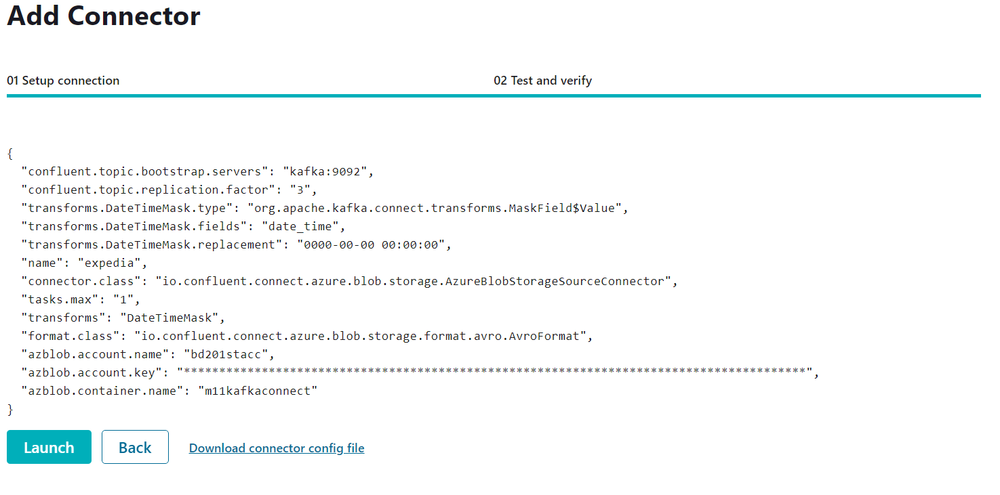
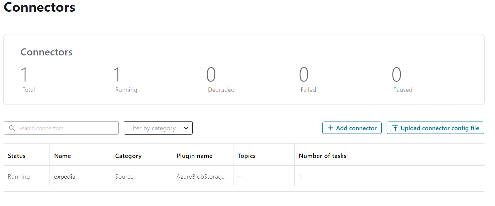
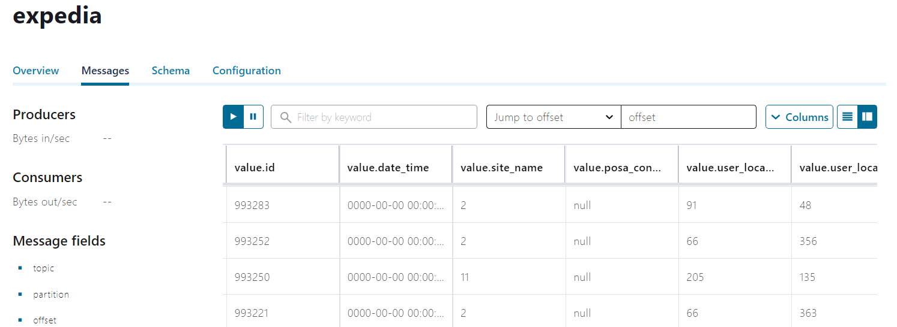

# Kafka connect in Kubernetes

## Install Confluent Hub Client

You can find the installation manual [here](https://docs.confluent.io/home/connect/confluent-hub/client.html)

## Create a custom docker image

For running the azure connector, you can create your own docker image. Create your azure connector image and build it.

## Launch Confluent for Kubernetes

### Create a namespace

- Create the namespace to use:

  ```cmd
  kubectl create namespace confluent
  ```

- Set this namespace to default for your Kubernetes context:

  ```cmd
  kubectl config set-context --current --namespace confluent
  ```

### Install Confluent for Kubernetes

- Add the Confluent for Kubernetes Helm repository:

  ```cmd
  helm repo add confluentinc https://packages.confluent.io/helm
  helm repo update
  ```

- Install Confluent for Kubernetes:

  ```cmd
  helm upgrade --install confluent-operator confluentinc/confluent-for-kubernetes
  ```

### Install Confluent Platform

- Install all Confluent Platform components:

  ```cmd
  kubectl apply -f ./confluent-platform.yaml
  ```

- Install a sample producer app and topic:

  ```cmd
  kubectl apply -f ./producer-app-data.yaml
  ```

- Check that everything is deployed:

  ```cmd
  kubectl get pods -o wide 
  ```

### View Control Center

- Set up port forwarding to Control Center web UI from local machine:

  ```cmd
  kubectl port-forward controlcenter-0 9021:9021
  ```

- Browse to Control Center: [http://localhost:9021](http://localhost:9021)

## Create a kafka topic

- The topic should have at least 3 partitions because the azure blob storage has 3 partitions. Name the new topic: "expedia".
- To create kafka topic go to localhost:9021, Topics -> Add a topic

## Prepare the azure connector configuration
- Go to /connectors folder
- Modify azure-source-cc-expedia.json file
## Upload the connector file through the API
- To upload file go to localhost:9021, Connect -> choose connect -> Add connector -> Upload connector config file(azure-source-cc-expedia.json)


  
- Check that everything is ok
